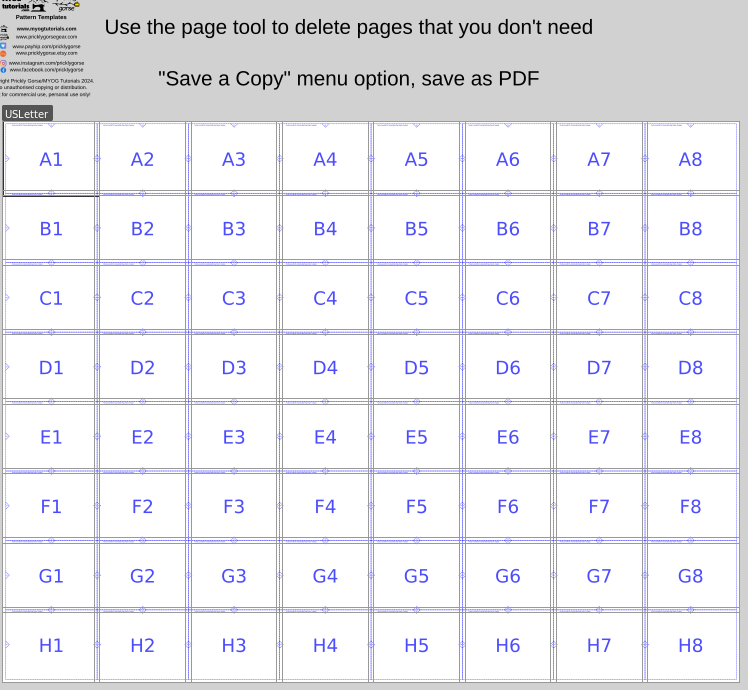

# Inkscape-Tiled-Page-Templates

A4 and US letter Portrait + Landscape multi-page printable templates for Inkscape.

Originally planned to release the Inkscape extension that creates these but too many unfixable bugs with text boxes (Inkscape can't calculate text bounding boxes in python).

Inkscape version 1.2 or newer required.

Paste your homemade patterns, technical illustrations etc into the template. Use the page tool to remove the pages you don't need, then use File - Save As - PDF. Your pattern is now beautifully split into pages and you can cut at the blue lines to reassemble.

If you need more than 8 by 8 pages, what are you making? Let me know

## Prickly Gorse / MYOG tutorials Sewing Guides

I wrote this to assist with making sewing patterns for bike and backpacking bags. Bit of a shameless plug, but if you are interested in sewing your own outdoor gear without making your own patterns, check out  [www.myogtutorials.com](http://www.myogtutorials.com) for MYOG sewing focused site (patterns and articles), [www.payhip.com/pricklygorse](http://www.payhip.com/pricklygorse) where my sewing guides are hosted, or [www.pricklygorsegear.com/tutorials-myog](http://www.pricklygorsegear.com/tutorials-myog) for my handmade bags website.

You can also donate at this [link](https://www.paypal.com/donate/?business=WBEASYMGED4X8) if you find it useful :)
